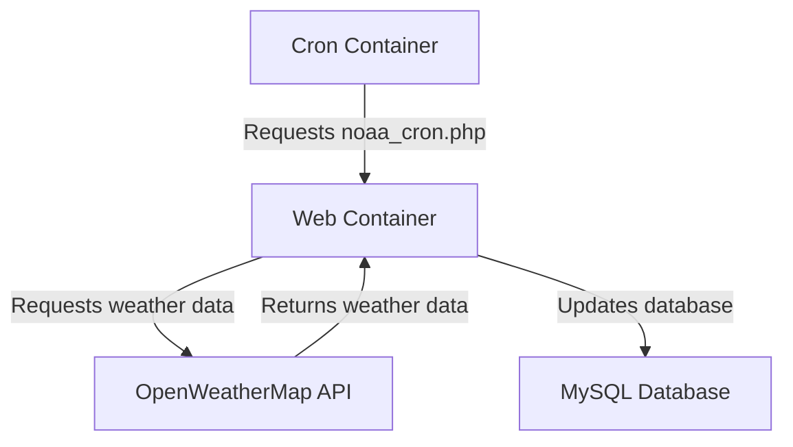

# takeasweater-server

Server side of the Take-A-Sweater application, a service that provides weather data and predictions based on current and forecasted conditions.

## Overview

Take-A-Sweater helps users decide what to wear based on weather conditions. This repository contains the backend services that:
- Collect and store weather data from external APIs
- Process weather information for different locations
- Provide an API for the client application to retrieve recommendations

## Setup

To get a local development running, make sure [docker is installed and running](https://docs.docker.com/get-started/) and then do the following:

1. Setup environment variables
```
cp .env.example .env
```
2. Start docker services
```
docker compose up
```
3. Visit http://localhost:8000 in your web browser

### Docker

This project uses Docker to containerize its services, with `docker-compose.yml` orchestrating the following three components:

| Service Name | Dockerfile         | Description                                      |
|--------------|--------------------|--------------------------------------------------|
| `web`        | `Dockerfile.web`   | Runs PHP + Apache web server                     |
| `cron`       | `Dockerfile.cron`  | Runs cron to update weather data periodically    |
| `db`         | `Dockerfile.mysql` | Runs a MySQL database to persist weather data    |

### Environment Variables

The `.env` file is used to configure environment variables for the `web` service. To set up the environment, copy the example file and modify it as needed:

```
cp .env.example .env
```

Key environment variables include:

- `OPENWEATHERMAP_API_KEY` (optional): API key for retrieving weather data from [OpenWeatherMap](https://openweathermap.org/).

Database-related environment variables are pre-configured in `docker-compose.yml`. However, you can override them in the `.env` file if necessary.

### Connecting to the database

The MySQL database port (3306) is exposed by default by the docker compose `db` service, so it's possible to connect using your preferred MySQL client or GUI.

#### Connecting with MySQL Shell

To connect using [MySQL Shell](https://dev.mysql.com/doc/mysql-shell/8.0/en/) (a modern replacement for the legacy [MySQL Command-Line Client](https://dev.mysql.com/doc/refman/8.4/en/mysql.html)), run the following:

```
mysqlsh --uri "takeasweater:takeasweater@localhost:3306/takeasweater"
```

#### Connecting with Docker Compose

```
docker compose exec db mysql -uroot -proot takeasweater
```

### Database Schema and Initial Data

The database schema and initial data are located in the `db` directory:

1. **Database schema**: `db/01_schema.sql`
2. **Initial data snapshot**: `db/init_data/snapshot.zip`

The `snapshot.zip` file contains CSV files for each database table. It is compressed because the `noaa_weather.csv` file is quite large (over 150MB). Using CSV files allows flexibility in switching to a different database system, such as PostgreSQL or SQLite.

To extract and view the contents of the snapshot:

```bash
unzip -d db/init_data db/init_data/snapshot.zip
tree db/init_data
```

The extracted files include:

```
db/init_data
├── location.csv
├── noaa_weather.csv
├── precip_codes.csv
├── sky_codes.csv
├── weather.csv
├── weather_modified.csv
└── wind_codes.csv
```

These files provide the initial data required to populate the database.

### Cron for Scheduled Weather Updates

The application uses a dedicated cron container to periodically update weather data. Here's an overview of how it works:

1. **Cron Container**: The `Dockerfile.cron` defines a container specifically for running scheduled tasks using [cron](https://www.redhat.com/en/blog/automate-linux-tasks-cron).
2. **Configuration**: The cron container is configured in `docker-compose.yml` with the `TAKEASWEATER_URL` environment variable, enabling it to communicate with the web service.
3. **Scheduled Task**: The cron container periodically executes the script `cron/takeasweater.sh`. This script makes an HTTP request to `noaa_cron.php`, which retrieves updated weather data from the OpenWeatherMap API and updates the database accordingly.

#### Diagram



This diagram illustrates the flow of data between the cron container, web service, OpenWeatherMap API, and the database.

